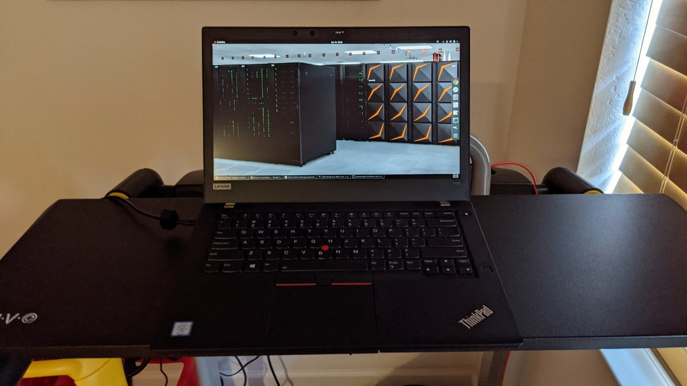

# ThinkPad T480 / T480s Tuning Toolkit


<sub>Photo: Elizabeth K. Joseph, [CC BY 2.0](https://creativecommons.org/licenses/by/2.0/), via [Wikimedia Commons](https://commons.wikimedia.org/wiki/File:ThinkPad_T480.jpg)</sub>

Scripts + methodology to safely undervolt an 8th-gen ThinkPad (T480/T480s, i7-8550U or similar), raise its real sustained power limits, and fix the stock fan curve — recovering clock speed and battery life the firmware leaves on the table, without guessing your way into a crash.

Validated on a real ThinkPad T480 (i7-8550U, Linux Mint 22.3 Cinnamon — Ubuntu/Debian-based, so `apt`/`systemd` commands below apply as-is) over several days of iteration. T480s shares the same board family and CPU generation, so this should transfer directly — but see the safety section below: **your chip's safe limits are not the same as this author's,** and the scripts are written to help you find your own, not to hand you a fixed number to copy.

## The problem this solves

Stock, these laptops:
- Ship a power limit (PL1) far below what the chip is actually rated for, so sustained multi-core load throttles harder and sooner than it needs to.
- Run CPU core/cache/iGPU voltage higher than most individual chips need, wasting power as heat.
- Often have a fan curve that's either too aggressive (loud) or, after certain updates, silently broken (defaults to firmware auto-control because it can't find its temperature sensor — see the thinkfan section).

Fixing all three (undervolt + realistic power limit + correct fan curve) typically buys noticeably higher sustained clocks at the same or lower temperature, and quieter operation — for free, using only what the silicon is already rated for. None of this is overclocking; it's removing conservative margin the stock firmware assumes for the worst chip off the line.

## Before you start: BIOS prerequisite (read this first)

Undervolting on Intel chips works by writing to MSRs (model-specific registers). In late 2019, Intel shipped a microcode/BIOS mitigation for the **Plundervolt** vulnerability (CVE-2019-11157) that many OEMs — including Lenovo — rolled into BIOS updates. **If your BIOS has that mitigation, MSR voltage-plane writes are rejected outright and nothing in this repo will work,** regardless of permissions or the `msr` kernel module being loaded.

- This author's T480 (machine type `20L5`, BIOS `N24ET54W` v1.29) has undervolting working — i.e. that BIOS version was not (or not fully) locked down.
- Check your own BIOS version: `cat /sys/class/dmi/id/bios_version` (or in the BIOS setup screen directly).
- If undervolting fails outright once everything below is installed (the `undervolt` tool errors on every write, not just at extreme offsets), your BIOS is very likely locked. The only known fix is running a BIOS version from before the mitigation — Lenovo blocks downgrading below your currently-installed version on many models (anti-rollback), so this may mean sourcing an old BIOS image and flashing it via a recovery/USB method. This is genuinely device- and firmware-version-specific; see:
  - [Thinkpad Forum: T480 undervolting how-to](https://www.forum.thinkpads.com/viewtopic.php?t=127405)
  - [Thinkpad Forum: x280 — undervolting permanently disabled, BIOS downgrade blocked](https://www.forum.thinkpads.com/viewtopic.php?t=136101)

Don't skip this check — it's the single most common reason this doesn't work for someone.

## What's in here

| Script | Purpose |
|---|---|
| `undervolt-stability-test.sh` | Fast smoke test — steps core/cache through -60/-75/-90 mV with a 30s all-core load, checking `dmesg` for machine-check/WHEA errors. Good for ruling out obviously broken values quickly. **Not sufficient on its own for locking in a permanent value** (see below). |
| `undervolt-deep-sweep.sh` | Finds where your chip actually walls out. Steps core+cache from -100 to -160 mV with a real AVX/FPU/matrix stress load (`stress-ng` if installed) per step, auto-reverting to a safe value on any hardware error or on exit. This is how you find *your* number, not this author's. |
| `deploy-undervolt-persistence.sh` | Locks in a chosen offset permanently: installs a systemd oneshot service (applies at boot) + a suspend/resume hook (offsets reset on wake otherwise). Edit the `OFFSETS` line to your own soak-tested value before running. |
| `freq-cap-sweep.sh` | Sweeps `intel_pstate/max_perf_pct` to find what sustained-clock cap gets you to a target temperature, given your current undervolt. Re-run this any time you change your undervolt depth — the relationship shifts. |
| `deploy-freqcap-persistence.sh` | Locks in a chosen `max_perf_pct` cap the same way (boot service + resume hook). |
| `update-thinkfan.sh` | Installs a `thinkfan` config that tracks Package + all 4 cores by sensor **name** (not hwmon number — the number gets reassigned across boots and silently breaks thinkfan otherwise), with a capped top tier instead of an uncapped "disengaged" tier (much quieter under sustained load). |

## Exact method — do these in order

1. **Confirm your BIOS isn't locked** (above). Don't proceed until you've checked.
2. **Install prerequisites:**
   ```bash
   sudo apt install msr-tools stress-ng pipx
   pipx install undervolt
   ```
   `undervolt` lands at `~/.local/bin/undervolt` (via pipx) — the scripts resolve this automatically even when run with `sudo`.
3. **Find your chip's real limit**, not this author's:
   ```bash
   sudo bash undervolt-stability-test.sh   # quick sanity pass, ~2 min
   sudo bash undervolt-deep-sweep.sh       # the real hunt, ~15 min, finds your wall
   ```
   Read the log it produces. Back off **15-20 mV from the deepest clean step** — deeper offsets need more margin, not less, because the wall gets sharper and temperature/aging shift the true minimum voltage over time.
4. **Soak test before trusting it.** This is the step people skip and regret. A short synthetic stress pass is necessary but *not sufficient* — a value that survives 90 seconds of `stress-ng` can still crash under a real workload hours or days later (this happened to the author at -130 mV: clean sweep, real-world crashes). Run your candidate value for real, for days, doing your actual work, before calling it permanent.
5. **Lock it in:** edit the `OFFSETS` line in `deploy-undervolt-persistence.sh` to your soak-tested value, then `sudo bash deploy-undervolt-persistence.sh`. Verify with `sudo ~/.local/bin/undervolt -r`.
6. **Set a real power limit.** The stock PL1 default is usually not a real limit — check your chip's actual cTDP-up spec (Intel ARK) and set it in the same script's `OFFSETS` line (`-p1 <watts> <window>`). PL2 (burst) can go higher too; on a thermally-governed chassis like this, PROCHOT reins in a burst within seconds regardless, so raising PL2 costs nothing.
7. **Tune the sustained-clock/temperature tradeoff:**
   ```bash
   sudo bash freq-cap-sweep.sh
   ```
   Pick a `max_perf_pct` from the results that matches your target temperature, put it in `deploy-freqcap-persistence.sh`'s `CAP=` line, then `sudo bash deploy-freqcap-persistence.sh`.
8. **Fix the fan curve:** `sudo bash update-thinkfan.sh`, then confirm with `systemctl status thinkfan` and watch `/proc/acpi/ibm/fan` under load.
9. **Verify everything survives a reboot and a suspend/resume cycle** — that's the actual point of the systemd units, and it's easy to test one boot and never check again.

## Safety notes (read before changing any offset)

- **Silicon lottery is real.** This author's chip walled out at -150 mV in the deep sweep (locked -130 permanent, then reverted further to -80/-100 after real-world instability at -130). Don't copy anyone's mV numbers, including this repo's example values — find your own with the sweep script.
- **The synthetic-test trap:** a value that survives a short stress test is not proven stable. Only a multi-day real-world soak test is.
- **Leave uncore/system-agent (analogio) voltage alone.** Unlike core/cache, an unstable uncore offset can cause *silent* memory-controller data corruption instead of a clean crash — there's no dmesg error to catch it. Not worth the risk without a memtest-grade integrity run, which these scripts don't do.
- **The temperature target (`-t` in the `undervolt` tool) may be rejected by your chip's microcode** — this is normal on some units (a real fault, not a permissions issue) and just means the stock ~97°C PROCHOT threshold is your fixed ceiling. The PL1 cap is your actual anti-throttle lever in that case.
- **Fresh chip, fresh sweep.** If you ever repaste, add RAM, or change the power limit, your thermal headroom changes — the freq-cap sweep result especially should be redone.

---

*Assisted by [Claude Code](https://claude.ai/code)*
